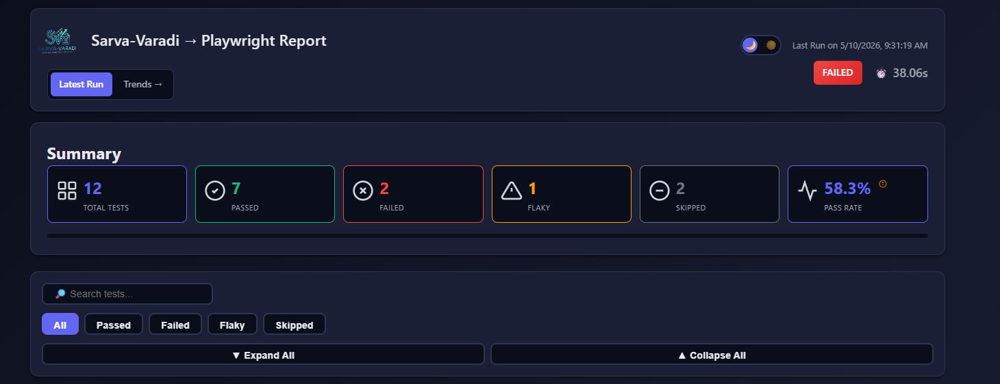
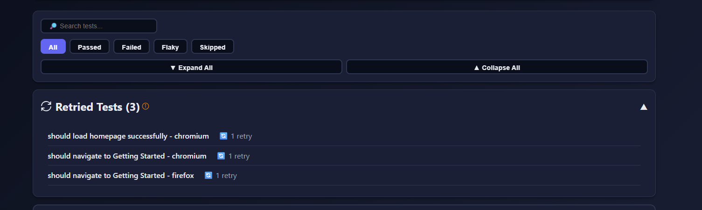
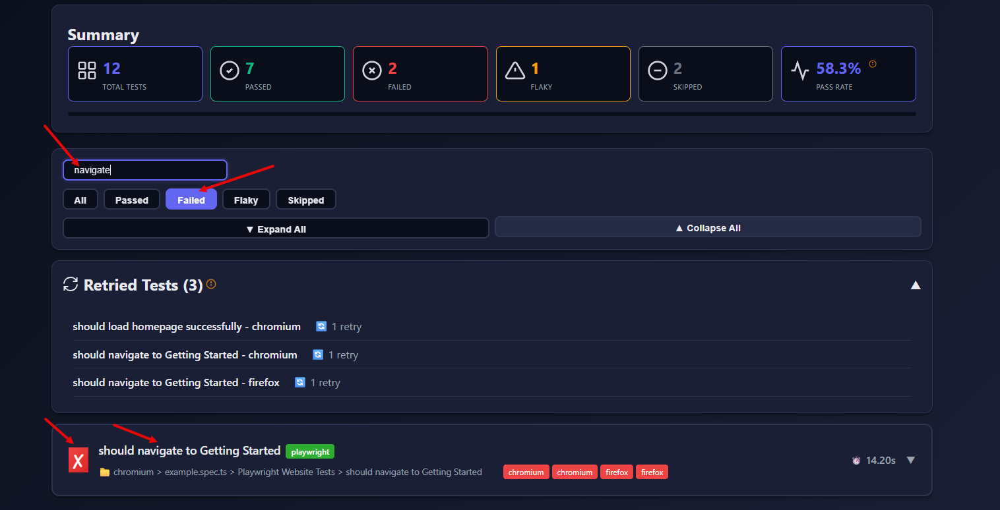
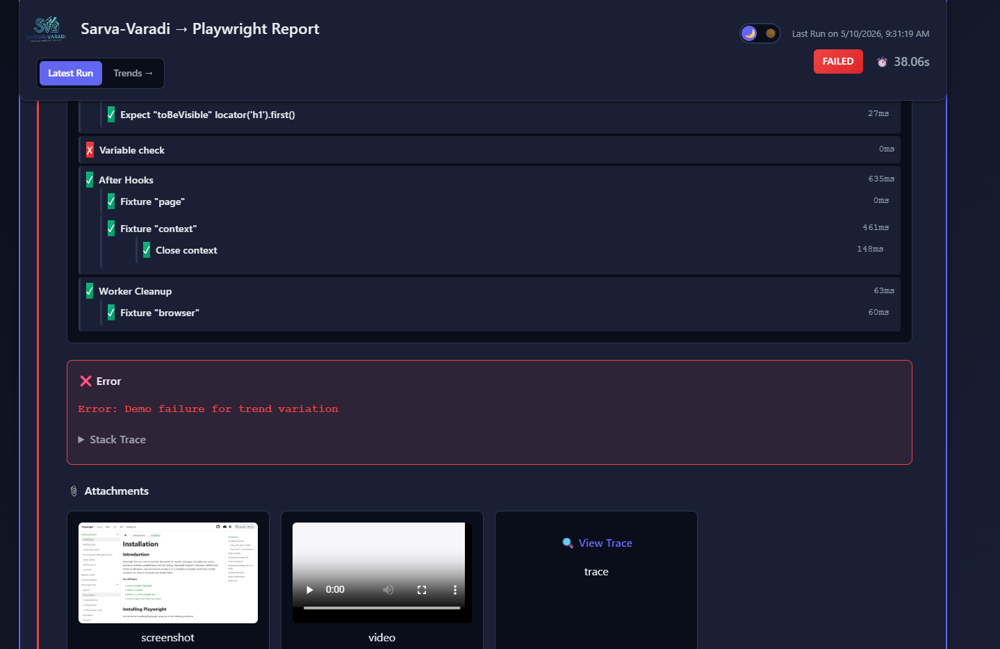
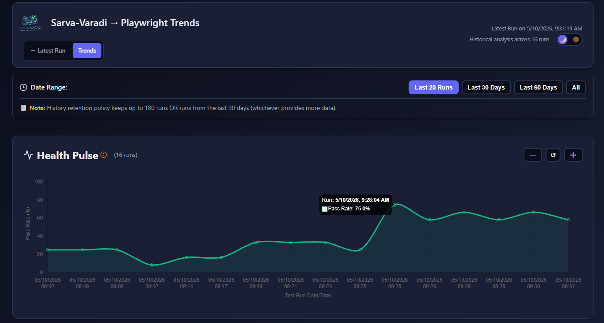
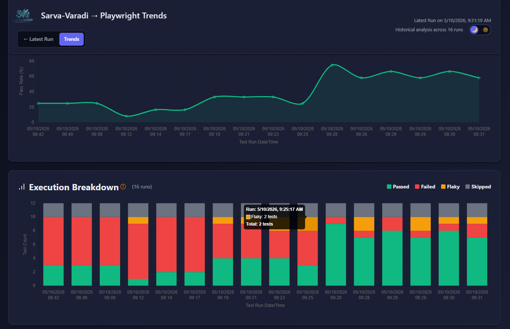
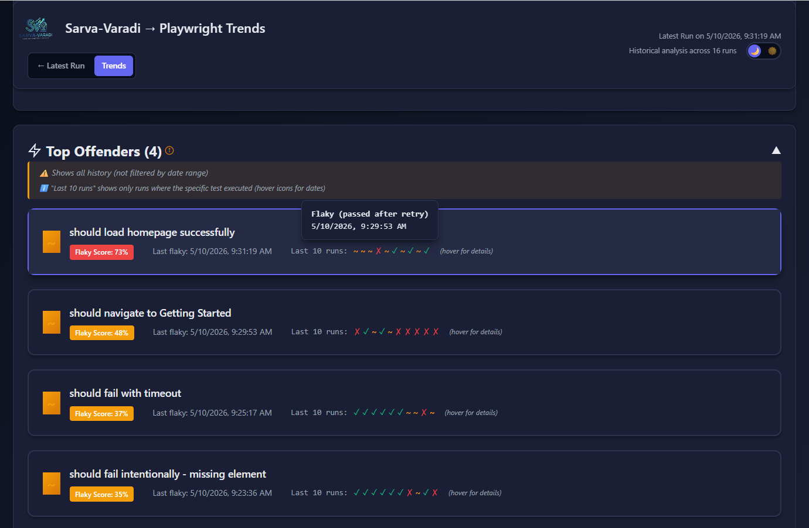
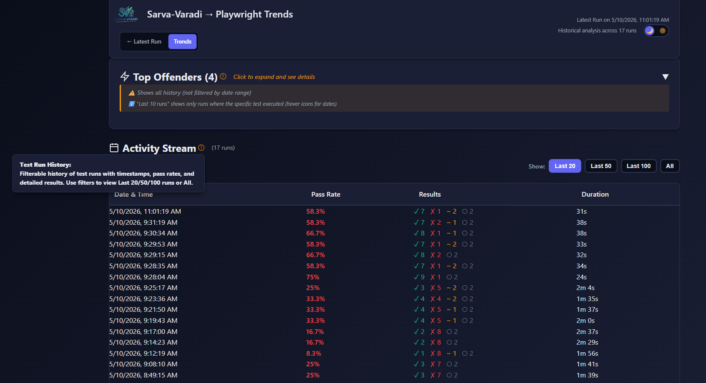

<p align="center">
  
</p>

<h1 align="center">Sarva-Varadi - <sub><sup>Unified Insights...Universal Reports</sup></sub></h1>

<p align="center">
  <strong>Comprehensive test reporting framework with historical trend analysis, intelligent flaky test detection, and interactive dashboards for multiple test automation tools.</strong>
</p>

<p align="center">
  Zero config • File-based • Beautiful UI • Multi-framework
</p>

<p align="center">
  <strong>"Sarva"</strong> means "All" or "Universal", <strong>"Varadi"</strong> means "Reporting" - one reporter for all your testing tools.
</p>

<p align="center">
  
  
  
</p>

<p align="center">
  <a href="#-quick-start">Quick Start</a> •
  <a href="https://yoggit.github.io/sarva-varadi">🎬 Live Demo</a> •
  <a href="#-features">Features</a> •
  <a href="#-visual-preview">Screenshots</a> •
  <a href="QUICKSTART.md">Full Docs</a>
</p>

<p align="center">
  <strong>🎭 <a href="https://yoggit.github.io/sarva-varadi/playwright/trends.html">Playwright Demo</a></strong> • 
  <strong>🌐 <a href="https://yoggit.github.io/sarva-varadi/selenium/trends.html">Selenium Demo</a></strong> • 
  <strong>🔌 <a href="https://yoggit.github.io/sarva-varadi/rest-assured/trends.html">RestAssured Demo</a></strong>
</p>

---

## 🎯 Supported Frameworks

<table>
<tr>
<td width="25%" align="center"><strong>🎭 Playwright</strong><br/>Web automation<br/>TypeScript/JavaScript</td>
<td width="25%" align="center"><strong>🔌 RestAssured</strong><br/>API testing<br/>Java/TestNG</td>
<td width="25%" align="center"><strong>🌐 Selenium</strong><br/>WebDriver browser tests<br/>Java/TestNG</td>
<td width="25%" align="center"><strong>🚧 Cypress</strong><br/>Modern web testing<br/><em>(Coming soon)</em></td>
</tr>
</table>

---

## ✨ Features

<table>
<tr>
<td width="50%">

**📊 Reporting & Analytics**
- 🎨 Beautiful dark/light theme UI
- 📈 Interactive trend charts with zoom
- 🔥 Intelligent flaky test detection
- 🎯 Top offenders leaderboard
- 📅 Activity stream with filters
- 📎 Rich attachments (screenshots/videos/traces)

</td>
<td width="50%">

**⚡ Developer Experience**
- ⚡ Zero config - works out of the box
- 📁 File-based - no database needed
- 🔄 Framework agnostic
- 🎪 Multi-browser support
- 🔍 Smart search & filtering
- 📧 Slack/Teams/Email notifications

</td>
</tr>
</table>

---

## 📸 Visual Preview

### Latest Report (`index.html`)

<details>
<summary><b>Summary Dashboard</b></summary>
<br>

<p><i>Overview of test execution with pass/fail/skip counts, duration, and mini trend widget</i></p>
</details>

<details>
<summary><b>Retried Tests View</b></summary>
<br>

<p><i>Dedicated section showing tests that were retried with their final status</i></p>
</details>

<details>
<summary><b>Search & Filters</b></summary>
<br>

<p><i>Filter tests by status (passed/failed/skipped) and search by test name</i></p>
</details>

<details>
<summary><b>Test Details - Expanded View</b></summary>
<br>

<p><i>Detailed test steps, error messages, stack traces, and attachments (screenshots, videos, traces)</i></p>
</details>

### Trends Dashboard (`trends.html`)

<details>
<summary><b>Health Pulse - Pass Rate Trends</b></summary>
<br>

<p><i>Interactive line chart showing pass rate over time with date range filters and zoom controls</i></p>
</details>

<details>
<summary><b>Execution Breakdown</b></summary>
<br>

<p><i>Stacked bar chart displaying test distribution (passed/failed/flaky/skipped) per run</i></p>
</details>

<details>
<summary><b>Top Offenders - Flaky Tests</b></summary>
<br>

<p><i>Historically flaky tests with scores (0-100), last flaky date, and last 10 runs visualization with hover tooltips</i></p>
</details>

<details>
<summary><b>Activity Stream</b></summary>
<br>

<p><i>Filterable test run history (Last 20/50/100/All) with scrollable view showing date, pass rate, results, and duration</i></p>
</details>

---

## 🏗️ Architecture

Sarva-Varadi uses a **two-phase execution model** inspired by Allure:

### Phase 1: Data Collection
During test execution, framework-specific adapters convert test results into a standardized JSON format.

### Phase 2: Report Generation
After execution, the core generator creates beautiful HTML reports from the collected data.

```
┌─────────────────┐
│  Playwright     │──┐
│  Selenium       │──┼──→ Adapter ──→ Common JSON ──→ Report Generator ──→ HTML
│  Cypress        │──┤                                                       
│  RestAssured    │──┘
└─────────────────┘
```

---

## 📦 Installation

> 🚀 **New to Sarva-Varadi?** Check out the [QUICKSTART.md](QUICKSTART.md) guide!

### For Playwright

```bash
npm install --save-dev @sarva-varadi/core @sarva-varadi/playwright
```

### For RestAssured (API Testing)

```bash
npm install --save-dev @sarva-varadi/core @sarva-varadi/rest-assured
```

### For Selenium (WebDriver + TestNG)

```bash
npm install --save-dev @sarva-varadi/core @sarva-varadi/selenium
```

---

## 🚀 Quick Start

<details>
<summary><b>🎭 Playwright Configuration</b></summary>

### Installation

```bash
npm install --save-dev @sarva-varadi/core @sarva-varadi/playwright
```

### Setup

Add to your `playwright.config.ts`:

```typescript
import { defineConfig, devices } from '@playwright/test';

export default defineConfig({
  reporter: [
    ['list'],
    ['@sarva-varadi/playwright', {
      outputFolder: 'sarva-report',
      title: 'My Test Report',
      history: {
        enabled: true,
        maxRuns: 30,
        retentionDays: 90,
      },
      trends: {
        enabled: true,
        showInMainReport: true,
      },
    }]
  ],
  use: {
    screenshot: 'only-on-failure',
    video: 'retain-on-failure',
    trace: 'on-first-retry',
  },
  // Configure browsers for parallel execution
  projects: [
    {
      name: 'chromium',
      use: { browserName: 'chromium' },
    },
    {
      name: 'firefox',
      use: { browserName: 'firefox' },
    },
    // Uncomment to enable additional browsers
    // {
    //   name: 'webkit',
    //   use: { browserName: 'webkit' },
    // },
    // {
    //   name: 'Mobile Chrome',
    //   use: {
    //     browserName: 'chromium',
    //     ...devices['Pixel 5'],
    //   },
    // },
    // {
    //   name: 'Mobile Safari',
    //   use: {
    //     browserName: 'webkit',
    //     ...devices['iPhone 12'],
    //   },
    // },
  ],
});
```

### Features

- ✅ Automatic screenshot/video capture on failure
- ✅ Playwright trace integration
- ✅ Multi-browser support with automatic grouping
- ✅ Flaky test detection with retry tracking
- ✅ Historical trends and pass rate analysis
- ✅ Test steps with timing information

### Multi-Browser Testing

- Reports automatically group results by browser
- Test names include browser suffix (e.g., "Login Test - chromium")
- Install browsers: `npx playwright install`
- Enable parallel execution with `fullyParallel: true` and `workers: 2` or more

### Run Tests

```bash
npx playwright test
```

### Open Report

```bash
# Windows
start sarva-report/index.html

# macOS
open sarva-report/index.html

# Linux
xdg-open sarva-report/index.html
```

</details>

<details>
<summary><b>🔌 RestAssured Configuration (API Testing)</b></summary>

### Installation

```bash
npm install @sarva-varadi/rest-assured @sarva-varadi/core
```

### Setup

**1. Copy the TestNG Listener**

Create `src/test/java/SarvaVaradiListener.java` and `src/test/java/SarvaVaradiRetryAnalyzer.java` from the [package documentation](packages/rest-assured/README.md).

**2. Add to testng.xml**

```xml
<!DOCTYPE suite SYSTEM "https://testng.org/testng-1.0.dtd">
<suite name="API Test Suite">
    <listeners>
        <listener class-name="SarvaVaradiListener"/>
    </listeners>
    <test name="API Tests">
        <classes>
            <class name="com.example.tests.UserApiTest"/>
        </classes>
    </test>
</suite>
```

**3. Configure Request Capture**

Add the RestAssured filter to your test setup:

```java
import io.restassured.RestAssured;
import org.testng.annotations.BeforeClass;
import org.testng.annotations.Test;
import static io.restassured.RestAssured.*;

public class UserApiTest {
    
    @BeforeClass
    public void setup() {
        RestAssured.baseURI = "https://api.example.com";
        RestAssured.filters(new RestAssuredRequestCapture());
    }

    @Test
    public void testGetUser() {
        given()
            .when()
            .get("/users/1")
            .then()
            .statusCode(200)
            .body("name", notNullValue());
    }

    // Enable retry for flaky test detection
    @Test(retryAnalyzer = SarvaVaradiRetryAnalyzer.class)
    public void testFlakyEndpoint() {
        given()
            .when()
            .get("/users/status")
            .then()
            .statusCode(200);
    }
}
```

**4. Run Tests & Generate Report**

```bash
# Run tests
mvn test

# Generate report
npx sarva-varadi generate --input sarva-varadi-results/test-results.json --output sarva-report
```

### Features

- ✅ Detailed request/response capture (method, URL, headers, body)
- ✅ Hierarchical test steps with parent-child structure
- ✅ Automatic flaky test detection with retry tracking
- ✅ Sensitive data masking (opt-in with `-Dsarva.maskSensitiveData=true`)
- ✅ Historical trends and pass rate analysis
- ✅ Works with any TestNG-based API tests

### Sensitive Data Masking (Optional)

By default, all request/response data is captured as-is. Enable masking when needed:

```bash
mvn test -Dsarva.maskSensitiveData=true
```

**What gets masked:**
- Headers: Authorization, X-API-Key, Cookie, Set-Cookie
- Body fields: password, token, secret, apikey, credit_card, ssn

### Configuration

Add to `package.json` for convenience:

```json
{
  "scripts": {
    "test": "mvn test",
    "report": "npx sarva-varadi generate --input sarva-varadi-results/test-results.json --output sarva-report",
    "test:report": "npm run test && npm run report"
  }
}
```

### Maven Dependencies

Add to `pom.xml`:

```xml
<dependencies>
    <dependency>
        <groupId>io.rest-assured</groupId>
        <artifactId>rest-assured</artifactId>
        <version>5.3.2</version>
        <scope>test</scope>
    </dependency>
    <dependency>
        <groupId>org.testng</groupId>
        <artifactId>testng</artifactId>
        <version>7.8.0</version>
        <scope>test</scope>
    </dependency>
    <dependency>
        <groupId>com.google.code.gson</groupId>
        <artifactId>gson</artifactId>
        <version>2.10.1</version>
        <scope>test</scope>
    </dependency>
</dependencies>
```

📖 **Full documentation:** [`packages/rest-assured/README.md`](packages/rest-assured/README.md)

📂 **Demo project:** [`demo-restassured/`](demo-restassured/)

</details>

<details>
<summary><b>🌐 Selenium Configuration (WebDriver + TestNG)</b></summary>

### Installation

```bash
npm install --save-dev @sarva-varadi/core @sarva-varadi/selenium
```

### Add TestNG Listener

Copy the Sarva-Varadi listener files to your test project:
- `SarvaVaradiSeleniumListener.java`
- `SarvaVaradiWebDriverListener.java`
- `SarvaVaradiRetryAnalyzer.java`

### Configure testng.xml

```xml
<?xml version="1.0" encoding="UTF-8"?>
<!DOCTYPE suite SYSTEM "https://testng.org/testng-1.0.dtd">
<suite name="Selenium Test Suite">
    <listeners>
        <listener class-name="io.github.yoggit.sarvavaradi.SarvaVaradiSeleniumListener"/>
    </listeners>
    
    <test name="Selenium Tests">
        <classes>
            <class name="com.example.selenium.tests.LoginTest"/>
        </classes>
    </test>
</suite>
```

### Write Your Test

```java
import io.github.yoggit.sarvavaradi.SarvaVaradiRetryAnalyzer;
import io.github.yoggit.sarvavaradi.SarvaVaradiWebDriverListener;
import org.openqa.selenium.WebDriver;
import org.openqa.selenium.chrome.ChromeDriver;
import org.openqa.selenium.support.events.EventFiringDecorator;
import org.testng.annotations.*;

public class LoginTest {
    private WebDriver driver;
    
    @BeforeMethod
    public void setup() {
        WebDriver baseDriver = new ChromeDriver();
        SarvaVaradiWebDriverListener listener = new SarvaVaradiWebDriverListener(baseDriver);
        driver = new EventFiringDecorator(listener).decorate(baseDriver);
    }
    
    @Test(retryAnalyzer = SarvaVaradiRetryAnalyzer.class)
    public void testLogin() {
        driver.get("https://example.com/login");
        // Your test code
    }
    
    @AfterMethod
    public void teardown() {
        if (driver != null) driver.quit();
    }
}
```

### Run Tests & Generate Report

```bash
# Run tests
mvn clean test

# Generate Sarva-Varadi report
npx sarva-varadi convert \
  --input sarva-varadi-results/test-results.json \
  --output sarva-report \
  --format testng-selenium
```

### Features

- ✅ Automatic WebDriver action capture (clicks, navigation, form inputs)
- ✅ Screenshots on test failure
- ✅ Browser information (Chrome, Firefox, Edge)
- ✅ Flaky test detection with retry tracking
- ✅ Sensitive data masking (opt-in with `-Dsarva.maskSensitiveData=true`)

📖 **Full documentation:** [`packages/selenium/README.md`](packages/selenium/README.md)

📂 **Demo project:** [`demo-selenium/`](demo-selenium/)

</details>

---

## 🔄 Universal Converter

<details>
<summary><b>Generate Reports from Any Format (JUnit, TestNG, Cucumber)</b></summary>

<br>

Already have test results from other tools? Sarva-Varadi can convert them into beautiful reports using the CLI converter.

### Installation

```bash
# Install globally for CLI access
npm install -g @sarva-varadi/core

# Or use locally in your project
npm install --save-dev @sarva-varadi/core
npx sarva-varadi generate --input <file> --output <dir>
```

### Usage Examples

```bash
# JUnit XML (Maven Surefire, Gradle)
sarva-varadi generate --input target/surefire-reports/TEST-*.xml --output sarva-report

# TestNG XML
sarva-varadi generate --input test-output/testng-results.xml --output sarva-report

# Cucumber JSON
sarva-varadi generate --input cucumber-report.json --output sarva-report --title "API Tests"

# Already in Sarva-Varadi format (no conversion needed)
sarva-varadi generate --input sarva-data.json --output sarva-report
```

### Smart Auto-Detection

The converter intelligently detects the format and handles conversion automatically:

| Format | Detection Method | Notes |
|--------|------------------|-------|
| **Sarva-Varadi JSON** | Checks for required fields (`tool`, `name`, `status`, `duration`) | **Skips conversion** - direct pass-through |
| **JUnit XML** | Looks for `<testsuites>` or `<testsuite>` root | Maven Surefire, Gradle test reports |
| **TestNG XML** | Looks for `<testng-results>` or `<suite>` root | Standard TestNG output |
| **Cucumber JSON** | Checks for `type: "feature"` and `elements` array | Cucumber JSON formatter output |

**Key Features:**
- 🎯 Zero-config format detection - just point to your file
- ⚡ **Intelligent skip** - if data is already in Sarva-Varadi format, no conversion overhead
- 📁 Works with both XML and JSON files
- 🔄 Same beautiful reports as native adapters
- 📊 Full historical tracking and trend analysis included
- 🎨 Consistent UI across all converted formats

### CLI Options

```bash
sarva-varadi generate [options]

Options:
  --input, -i <path>     Input test results file (required)
  --output, -o <path>    Output directory for reports (required)
  --title, -t <title>    Custom report title (optional)
  --help, -h             Show help message

Examples:
  # Basic usage
  sarva-varadi generate -i junit.xml -o sarva-report
  
  # With custom title
  sarva-varadi generate -i testng.xml -o reports --title "Regression Suite"
  
  # CI/CD integration
  sarva-varadi generate -i $REPORT_PATH -o $OUTPUT_DIR
```

### What Gets Generated

After running the CLI, you'll get:

```
sarva-report/
├── index.html              # Latest run report with test details
├── trends.html             # Historical trends dashboard
├── attachments/            # Screenshots, videos (if present)
└── history/
    ├── runs.json          # Run metadata and trends
    └── 2026-05-10-*/      # Archived run data
        └── data.json
```

### Supported Formats

| Format | Status | File Extension | Common Source |
|--------|--------|----------------|---------------|
| Sarva-Varadi JSON | ✅ Native | `.json` | Playwright/Selenium adapters |
| JUnit XML | ✅ Supported | `.xml` | Maven Surefire, Gradle |
| TestNG XML | ✅ Supported | `.xml` | TestNG framework |
| Cucumber JSON | ✅ Supported | `.json` | Cucumber JSON formatter |
| Mocha JSON | 🚧 Coming soon | `.json` | Mocha `--reporter json` |
| Jest JSON | 🚧 Coming soon | `.json` | Jest `--json` |

### Use Cases

**1. Legacy Test Suites**
Convert existing JUnit/TestNG reports without changing your test framework:
```bash
sarva-varadi generate --input target/surefire-reports/*.xml --output sarva-report
```

**2. CI/CD Pipelines**
Add as a post-test step to generate reports from any tool:
```yaml
# GitHub Actions example
- name: Generate Sarva-Varadi Report
  run: |
    npm install -g @sarva-varadi/core
    sarva-varadi generate -i test-results.xml -o sarva-report
    
- name: Upload Report
  uses: actions/upload-artifact@v3
  with:
    name: test-report
    path: sarva-report/
```

**3. Multi-Framework Projects**
Combine reports from different testing tools into one consistent format:
```bash
# Convert Java tests
sarva-varadi generate -i junit.xml -o reports/java

# Convert BDD tests  
sarva-varadi generate -i cucumber.json -o reports/bdd
```

**4. Migration Path**
Start using Sarva-Varadi with existing reports, then migrate to native adapters later for richer features (screenshots, videos, traces).

### Conversion vs Native Adapters

| Feature | CLI Converter | Native Adapters (Playwright/Selenium) |
|---------|---------------|----------------------------------------|
| Test results | ✅ Yes | ✅ Yes |
| Pass/Fail/Skip status | ✅ Yes | ✅ Yes |
| Error messages & stack traces | ✅ Yes | ✅ Yes |
| Test duration | ✅ Yes | ✅ Yes |
| Historical trends | ✅ Yes | ✅ Yes |
| Flaky test detection | ✅ Yes | ✅ Yes |
| Screenshots | ⚠️ If in source format | ✅ Automatic |
| Videos | ⚠️ If in source format | ✅ Automatic |
| Trace files | ❌ Not available | ✅ Playwright only |
| Test steps | ⚠️ Cucumber only | ✅ Automatic |
| Retry information | ⚠️ Limited | ✅ Full retry tracking |
| Browser grouping | ⚠️ If in test name | ✅ Automatic |

**Recommendation:** Use the CLI converter for quick wins and legacy compatibility. For new projects or full feature support, use native adapters for the richest experience.

📖 **[Full Converter Documentation](CONVERTER.md)** - Detailed guide with CI/CD examples, troubleshooting, and advanced usage

</details>

---

## 📊 Two Views

### View 1: Latest Run (`index.html`)
- Current test execution results with summary dashboard
- Pass/fail/skip counts with visual progress bars
- Search and filter functionality (by status, test name, browser)
- Individual test details with steps, errors, and attachments
- Mini trend widget showing last 7 runs

### View 2: Trends Dashboard (`trends.html`)
- **Health Pulse**: Pass rate over time with interactive line chart
- **Execution Breakdown**: Test distribution per run (stacked bar chart)
- **Top Offenders**: Historically flaky tests with scores (0-100) and last flaky date
  - Shows only tests that actually passed after retry (intelligent detection)
  - Grouped by test name (removes browser duplicates)
  - Last 10 runs icons with hover tooltips showing date/time
- **Activity Stream**: Filterable history (Last 20/50/100/All) with vertical scrolling
- Date range filters and zoom controls on charts

Navigation between views via header buttons.

---

## ⚙️ Configuration Options

<details>
<summary><b>View all configuration options</b></summary>

<br>

| Option | Type | Default | Description |
|--------|------|---------|-------------|
| `outputFolder` | string | `'sarva-report'` | Directory for the report |
| `outputFile` | string | `'index.html'` | Report filename |
| `title` | string | `'Sarva-Varadi Test Report'` | Report title |
| `showStackTrace` | boolean | `true` | Show full stack traces |
| `embedAttachments` | boolean | `true` | Embed screenshots/videos |

### History Options

| Option | Type | Default | Description |
|--------|------|---------|-------------|
| `history.enabled` | boolean | `true` | Enable historical tracking |
| `history.maxRuns` | number | `20` | Keep last N runs (no hard limit, can be set to 100+ for extensive history) |
| `history.retentionDays` | number | `180` | Auto-cleanup after N days (6 months default, can be set to 365+ for longer retention) |
| `history.trackPerTest` | boolean | `true` | Track per-test flakiness |

**Storage & Performance:**
- No technical limit on `maxRuns` - can handle hundreds of runs
- Each run stored as separate JSON file (~1KB per run)
- Trend charts work best with 20-100 runs
- Flaky test detection improves with more historical data
- Longer retention provides better seasonal trend analysis

### Trends Options

| Option | Type | Default | Description |
|--------|------|---------|-------------|
| `trends.enabled` | boolean | `true` | Generate trends.html |
| `trends.showInMainReport` | boolean | `true` | Embed mini-trend widget |

### Notification Options

| Option | Type | Default | Description |
|--------|------|---------|-------------|
| `notifications.enabled` | boolean | `false` | Enable notifications |
| `notifications.slack` | object | - | Slack webhook configuration |
| `notifications.teams` | object | - | Teams webhook configuration |
| `notifications.email` | object | - | SMTP email configuration |

**📖 See [NOTIFICATIONS.md](NOTIFICATIONS.md) for detailed setup guide**

</details>

## 📂 Output Structure

<details>
<summary><b>View generated files structure</b></summary>

<br>

```
sarva-report/
├── index.html              # Latest run report
├── trends.html             # Historical trends dashboard
├── attachments/            # Screenshots, videos, traces
└── history/
    ├── runs.json          # Run metadata and trends data
    ├── 2026-05-09-143022/ # Individual run archive
    │   └── data.json
    └── 2026-05-08-091530/
        └── data.json
```

</details>

---

## 🎯 Historical Trends & Flaky Test Detection

<details>
<summary><b>Learn about intelligent flaky test detection</b></summary>

<br>

### Intelligent Flaky Test Detection

Sarva-Varadi tracks flaky tests across **entire history** (not just last 10 runs):
- **wasEverFlaky**: Permanent flag tracking if test was ever flaky
- **lastFlakyRunId**: Stores most recent flaky occurrence with date/time
- **Only counts true flaky tests**: Tests that passed after retry (not just failed retries)

### Flaky Score Calculation (0-100)

```
Score = (Status Changes / Total Runs × 100) + (Flaky Retries / Total Runs × 20)
```

- **Status changes**: Pass → Fail → Pass transitions
- **Flaky retries**: Only counts retries when test eventually passed

**Score interpretation:**
- `0-20`: Stable ✅
- `21-50`: Moderately flaky ⚠️
- `51-100`: Highly flaky 🔴

### Automatic Cleanup

Old test runs are automatically cleaned up based on **dual criteria**:
- Runs are deleted only when they exceed **BOTH** limits (if both configured)
- OR when they exceed the single configured limit

1. **maxRuns**: Keeps last N runs (default: 20, can be 100+)
2. **retentionDays**: Removes runs older than N days (default: 180)

</details>

---

## 📧 Notifications

<details>
<summary><b>Setup Slack, Teams, or Email notifications</b></summary>

<br>

Send test results automatically to Slack, Microsoft Teams, or Email:

### Quick Setup Example

```typescript
export default defineConfig({
  reporter: [
    ['@sarva-varadi/playwright', {
      notifications: {
        enabled: true,
        
        // Slack notification
        slack: {
          enabled: true,
          webhookUrl: process.env.SLACK_WEBHOOK_URL,
          // Example: 'https://hooks.slack.com/services/T00000000/B00000000/XXXXXXXXXXXXXXXXXXXX'
          channel: '#test-results',
          mentionOnFailure: ['john.doe', 'jane.smith'], // Optional: @mention on failures
        },
        
        // Microsoft Teams notification
        teams: {
          enabled: true,
          webhookUrl: process.env.TEAMS_WEBHOOK_URL,
          // Example: 'https://outlook.office.com/webhook/a1b2c3d4.../IncomingWebhook/...'
        },
        
        // Email notification
        email: {
          enabled: true,
          smtp: {
            host: 'smtp.gmail.com',
            port: 587,
            secure: false,
            auth: {
              user: process.env.EMAIL_USER,
              pass: process.env.EMAIL_PASS, // App password for Gmail
            },
          },
          from: 'noreply@yourcompany.com',
          to: ['qa@yourcompany.com', 'dev@yourcompany.com'],
          subject: 'Test Results - ${passRate}% Pass Rate', // Optional
        },
      },
    }]
  ],
});
```

### Environment Variables

```bash
# .env file (never commit this!)
SLACK_WEBHOOK_URL=https://hooks.slack.com/services/YOUR/WEBHOOK/URL
TEAMS_WEBHOOK_URL=https://outlook.office.com/webhook/YOUR/WEBHOOK/URL
EMAIL_USER=your-email@gmail.com
EMAIL_PASS=your-app-password
```

### Sample Notification Output

**Slack Message:**
```
📊 Test Results
━━━━━━━━━━━━━━━━━━
Total: 50           Pass Rate: 90%
Passed: ✅ 45       Failed: ❌ 3
Duration: 2m 5s     Skipped: ⏭️ 1
━━━━━━━━━━━━━━━━━━

Failed Tests:
• Login flow - timeout after 30s
• Checkout process - assertion failed
• API integration test - network error

[📊 View Full Report] (button)
```

**What gets sent:**
- ✅ Summary stats (total, pass rate, duration)
- ✅ Pass/Fail/Skip/Flaky counts
- ✅ Top 5 failed tests with names
- ✅ Link to full HTML report (if hosted)
- ✅ Color-coded status (🎉 green, ⚠️ yellow, 🚨 red)

**📖 Full documentation:** [NOTIFICATIONS.md](NOTIFICATIONS.md)

**🚀 Quick 5-minute setup:** [NOTIFICATIONS-SETUP.md](NOTIFICATIONS-SETUP.md)

</details>

---

## 🔄 Comparison with Other Tools

| Feature | Allure | ReportPortal | Sarva-Varadi |
|---------|--------|--------------|--------------|
| Multi-framework | ✅ 30+ | ✅ Many | ✅ 2+ (growing) |
| Modern UI | ⚠️ Dated | ⚠️ Complex | ✅ Beautiful |
| Zero config | ❌ CLI needed | ❌ Server setup | ✅ Yes |
| File-based | ✅ Yes | ❌ DB required | ✅ Yes |
| Historical trends | ✅ Basic | ✅ Advanced | ✅ File-based |
| Flaky detection | ⚠️ Manual | ✅ ML-based | ✅ Score-based |
| Notifications | ❌ No | ✅ Yes | ✅ Slack/Teams/Email |
| CI/CD friendly | ✅ Yes | ⚠️ Complex | ✅ Yes |
| Setup time | 15 min | 1+ hour | < 2 min |

---

## 🏛️ Monorepo Structure

```
packages/
├── core/              # @sarva-varadi/core
│   ├── types/        # Common interfaces
│   ├── adapters/     # Base adapter class
│   ├── converters/   # Format converters (JUnit, TestNG, Cucumber)
│   ├── generators/   # HTML report generation
│   └── history-manager.ts
│
├── playwright/        # @sarva-varadi/playwright
│   └── adapter.ts    # Playwright-specific adapter
│
├── rest-assured/      # @sarva-varadi/rest-assured
    ├── adapter.ts    # RestAssured adapter
    └── testng/       # TestNG listener & retry analyzer
```

---

## 🛠️ Development

<details>
<summary><b>Build from source and contribute</b></summary>

<br>

### Build from Source

```bash
# Clone the repository
git clone https://github.com/yoggit/sarva-varadi.git
cd sarva-varadi

# Install dependencies
npm install

# Build all packages
npm run build
```

### Local Development

```bash
# Link packages
cd packages/core && npm link
cd ../playwright && npm link @sarva-varadi/core && npm link

# In your test project
npm link @sarva-varadi/core @sarva-varadi/playwright
```

## 🤝 Contributing

Contributions are welcome! Especially for adding new framework adapters.

### Adding a New Framework Adapter

1. Create `packages/<framework>/`
2. Implement adapter extending `BaseAdapter`
3. Convert framework events → `SarvaTestResult`
4. Add demo project
5. Update documentation

See [CONTRIBUTING.md](CONTRIBUTING.md) for details.

</details>

---

## 📜 License

MIT License - see [LICENSE](LICENSE) file for details.

## 🙏 Acknowledgments

- Built on top of [Varadi](https://github.com/yoggit/varadi) - the beautiful Playwright reporter
- Inspired by [Allure](https://github.com/allure-framework) adapter architecture
- UI inherited from Varadi's modern design

## 📞 Support

- 🐛 [Report Issues](https://github.com/yoggit/sarva-varadi/issues)
- 💬 [Discussions](https://github.com/yoggit/sarva-varadi/discussions)
- 📖 [Examples](examples/)

---

Made with ✨ by [yoggit](https://github.com/yoggit)
